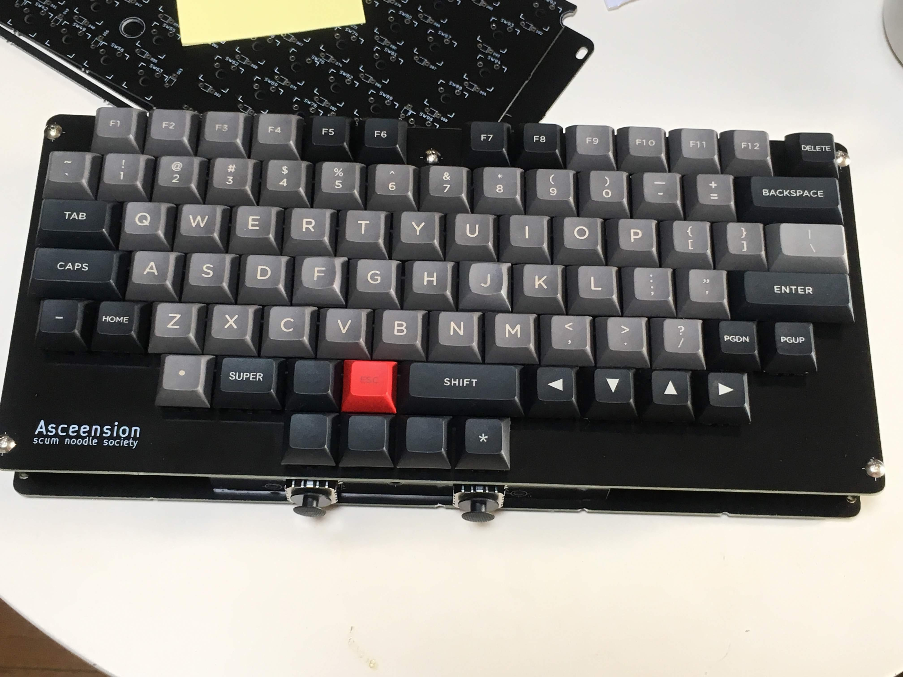

ASCEENSION
===

- Keyboard Maintainer: [hidsh](https://github.com/hidsh)

- Hardware Supported: asceension001

- Hardware Availability:  schematic and gerber are available

## Features

- suitable keymap for Emacs, Vim, and EVIL users

- x2 analog joypads as pointing device
 
## How to make

Make example for this keyboard (after setting up your build environment):

    make handwired/asceension:default

Or to make and flash:

    make handwired/asceension:default:avrdude

See [build environment setup](https://docs.qmk.fm/build_environment_setup.html) then the [make instructions](https://docs.qmk.fm/make_instructions.html) for more information.

## Hardware

- [schematic](docs/asceension002.pdf)

- [gerber](docs/gerber/) 

- [kicad data](docs/kicad/)
