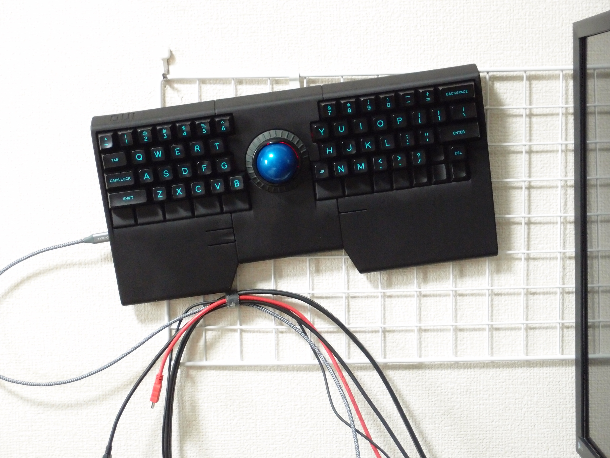

Ino
========


[layout](docs/ino-keymap.pdf)

[schematic](docs/ino-sch.pdf)

Ino - A keyboard with trackball and scroll ring

- Keyboard maintainer: hidsh
- Hardware supported: 
    - SKC03 PCB
    - Kensington Orbit with Scroll Ring
- Hardware availability:
    - DIY-Kit consists of PCBs and 3D-printed case

# Building the firmware

[Install the build tools.](https://docs.qmk.fm/#/getting_started_build_tools)

In the root directory of the repository, build the firmware with a command like:

```
make ino:default
```

and/or flashing firmware:

```
make ino:default:avrdude
```


For more information on the layout option and other ones, see the [`make` guide](https://docs.qmk.fm/#/getting_started_make_guide).

